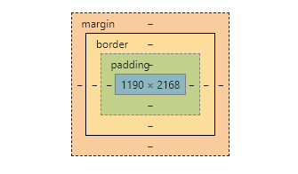
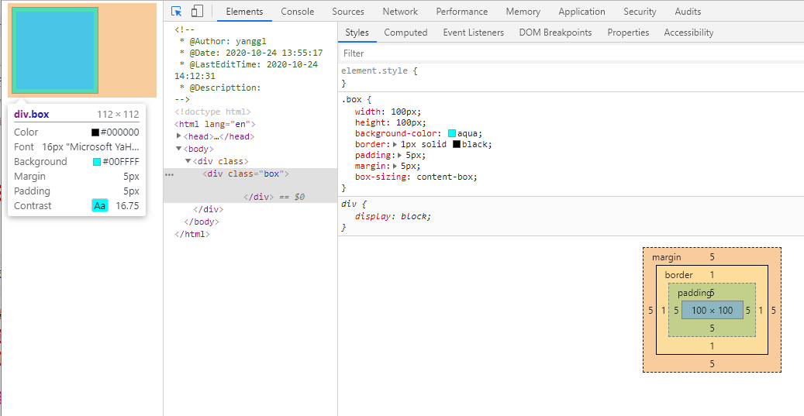
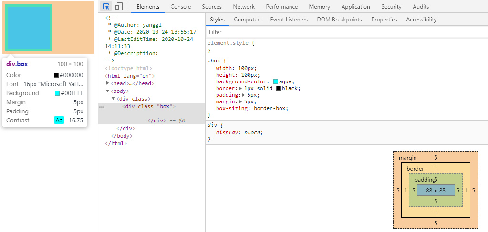

# css两种盒模型

css中完整的盒模型应用于块级盒子，内联盒子只使用盒模型定义的部分内容化。盒模型定义了盒的每个部分：

- **content box:** 显示内容的区域
- **padding box**: 内边距，内容区域与盒边框的空白区域
- **border box:** 盒边框，包裹内容区域与内边距
- **margin box:** 外边距，盒子与其他元素直接的空白区域

如下图所示：



css盒模型有两种：一种是w3c的标准盒模型，另一种是ie的怪异盒模型，现代浏览器一般默认采用w3c标准。

## 标准盒模型

w3c标准盒模型的width指盒子的内容区域，盒子的实际宽度为：content+padding+border。

从下图中可以看到给指定元素设置width:100px,内容区域始终为100px,设置padding:5px;border:1px 后盒子的实际宽度为112px。

高度计算同理可得。




## IE盒模型

ie盒模型的width包含盒的内容区域、内边距、边框。实际宽度即为css指定width,在设定padding,border后其content内容区域会变小。

下图为设置了ie盒模型的盒子展现形式：




**box-sizing**

切换盒模型可以通过使用css的box-sizing属性：

```
box-sizing: content-box; //w3c盒模型 默认值
box-sizing: border-box; //ie盒模型  ie8以下不支持切换，只能为怪异盒模型
```

