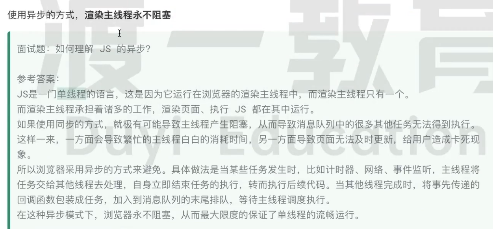
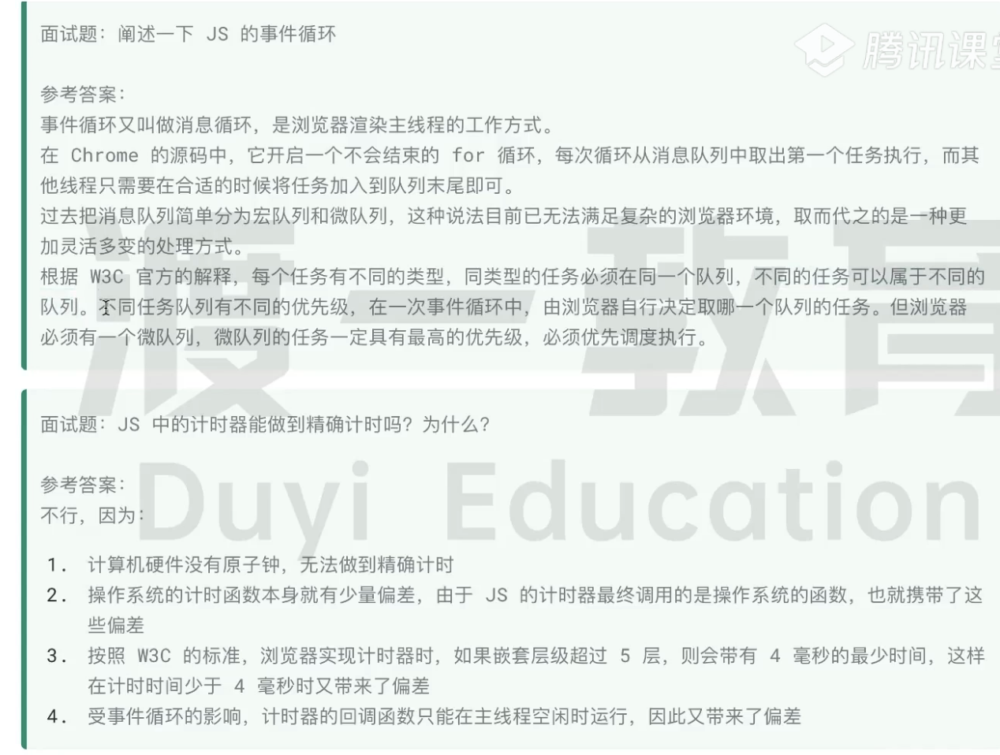

### 何为异步？

代码在执行过程中，遇到无法立即处理的任务

- 计时完成后用需要执行的任务 -- setTimeout、setInterval

- 网络通信完成后需要执行的任务 -- XHR Fetch

- 用户操作后需要执行的任务 -- addEventListener

  

### 任务优先级

W3C最新解释（不再使用旧版本的宏任务、微任务）

- 每个任务都有一个任务类型，同一个类型的任务必须在同一个队列，不同类型的任务可以分属不同的队列
- 浏览器必须准备好一个微队列，微队列的任务优先所有其它任务执行

### 理解js的异步解释js单线程

### 当前实现的chrome中，至少包含了如下队列

- 延时队列：用于存放计时器到达后的回调任务，优先级「中」
- 交互队列：用于存放用户操作后产生的事件处理任务，优先级「高」
- 微队列： 用于存放需要最快执行的任务，优先级「最高」

- 单线程是异步产生的原因

- 事件循环是异步的实现方式

