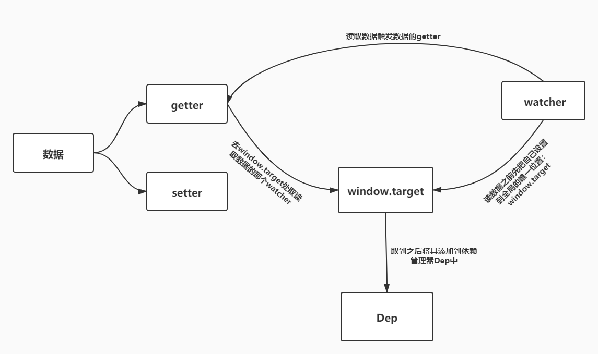

# 开始
## 1.前言
**之前不知道如何下手学习源码，这个学习记录也是看别人学习vue源码博客为加深印象而写，同时也是本菜鸟探索学习源码的方法之路，
重要的是这个博客也提供了学习vue源码的路线。**
## 2.学习路线
有学习路线才不会一头雾水，跟着下面这个学习路线走吧
**1.变化侦测篇**
学习Vue如何实现数据的响应式系统，从而达到数据驱动视图。
**2.虚拟DOM篇**
学习什么是虚拟DOM，以及Vue中的 DOM-diff原理。
**3.模板编译篇**
学习Vue内部是怎么把template模板编译成虚拟DOM，从而渲染出真实DOM。
**4.实例方法篇**
学习VUE中所有实例方法（即所有以$开头的方法）的实现原理。
**5.全局API篇**
学习VUE中所有全局API的实现原理。
**6.生命周期篇**
学习Vue中组件的生命周期实现原理。
**7.指令篇**
学习Vue中所有指令的实现原理。
**8.过滤器篇**
学习Vue中所有过滤器的实现原理。
**9.内置组件篇**
学习Vue中内置组件的实现原理。


# 变化侦测篇
## 1.综述
**1.1 前言** `Vue`的最大特点之一是数据驱动视图，那么什么是数据驱动视图呢？先看一个公式：
**UI = render(state)**

上述公式中：状态`state` 是输入，页面`UI`是输出，状态输入变化了，那么页面输出也随之变化，这种特性称之为数据驱动视图。
`state`和`UI`都是用户定的，不变的是`render()`,`Vue`就扮演了`render()`这个角色，当`Vue`发现`state`变化之后，经过一系列处理后，就会把这些变化反应在`UI`上。那么`Vue`是如何发现`state`变化的呢?这就需要学习一下`Vue`的变化侦测机制。

**1.2 什么是变化侦测呢**
变化侦测就是追踪状态，又或者说是监听数据的变化。当侦测到变化后就去更新视图。
在前端三大框架中都有变化侦测，在Angular中是通过脏值检查流程来实现变化侦测；在React是通过对比虚拟DOM来实现变化侦测；在Vue中也有变化侦测实现机制。
## 2.Object的变化侦测

**2.1 前言**
通过前面的了解，数据驱动视图的关键在于知道数据什么时候发生了变化，js提供了`Obejct.defineProperty`方法可以帮助我们知道数据什么时候被读取了什么时候被修改了。

**2.2 Object监测**
先看一个使用`Object.defineProperty`的`get()`和`set()`对对象的读写进行拦截的例子

```
let obj = {}
let value = 'val'
Object.defineProperty(obj,'name',{
    enumerable:true,
    configurable:true,
    get(){
        console.log('name属性被读取了');
        return value
    },
    set(val){
        console.log('name属性被修改了:',val);
        value = val
    }
})
console.log(obj.name)
obj.name = 123
console.log(obj.name)
// 输出:
// name属性被读取了
// val
// name属性被修改了: 123
// name属性被读取了
// 123

```
以上，对obj对象实现了观测，可以获取obj的读写情况。
那么如果要让一个对象的所有属性都变得可观测，我们定义一个observer类通过递归的方式把一个对象的所有属性都转换成可观测对象

```
export class Observer{
    constructor(value){
        this.value = value
         // 给value新增一个__ob__属性，值为该value的Observer实例
        //  相当于为value打上标记，标识已经被转换为响应式了，避免重复操作
        def(value,'__ob__',this)
        if(Array.isArray(value)){
        
        }else{
            this.walk(value)
        }
    }
    walk(obj:Object){
        const keys = Object.keys(obj)
        for(let i = 0;i<keys.length;i++){
            defineReactive(obj,keys[i])
        }
    }
}
/**
 * @description: 使一个对象转换成一个可观测对象
 * @param {Object} obj 被转换的对象
 * @param {String} key 对象的key
 * @param {Any} val 对象某个key的值
 * @return: 
 */
function defineReactive(obj,key,val){
    // 如果只传了obj key 则val = obj[key]
    if(arguments.length==2){
        val = obj[key]
    }
    // 如果val还是Object则递归使用Observer类处理
    if(typeof val ==='object'){
        new Observer(val)
    }
    Object.defineProperty(obj,key,{
        enumerable:true,
        configurable:true,
        get(){
            console.log(`${key}属性被读取了`)
            return val
        },
        set(newVal){
            console.log(`${key}属性被修改了`)
            val = newVal
        }
    })
}
```
上面代码中定义了一个`observer`类，这个类将一个正常的object转换成一个可观测的`object`。
并个每一个被转换的对象`value`新增一个`__ob__`属性，值为该`value`的`observer`实例。即对该对象进行标记表示已经转为响应式对象了，避免重复操作。
接着判断对象的数据类型，只有`value`为`Object`类型时才会调用`walk`，`walk`中遍历这个对象所有可枚举属性,并将这个对象及其自身所有可枚举属性作为参数传给`defineReactive`,`defineReactive`对于传入的属性获取其值，如果值为对象，则递归调用`observer`使其转换为可观测对象,否则修改对象中这个属性的存取描述符，通过`get/set`来侦测变化。实现只要将一个对象传到`observer`中，那么这个`object`就会变成可观测的、响应式的`object`。

## 3.依赖收集
**3.1 什么是依赖收集**
上一小节中，我们知道了让object数据变的可观测，这样就知道数据什么时候发生了变化，那么当数据发生了变化，就可以通知视图更新，但是视图内容很多，不能每次数据发生变化都更新整个视图，那么就需要知道谁使用了数据，即谁依赖了数据，我们依赖了这个数据的“谁”添加到这个数据的依赖数组中，当数据发生变化时，就通知依赖数组中的每一个对象，告诉他们数据变了，要进行视图更新了。

**3.2 何时收集依赖，何时通知依赖更新**
知道了什么是依赖收集后，我们明白：谁用到了这个数据，那么这个数据变化就通知谁，也就是谁获取了对象中属性的值，这个时候就可以在getter中收集这个依赖，那么当数据变化触发setter时就可以通知依赖更新。

**3.3 把依赖收集到哪里？**
3.1小节中提到可以给每个数据都建立一个依赖数组，谁依赖了这个数据就把谁放入这个数组中，但是这样代码有点欠缺且耦合度过高。可以将这个依赖收集功能扩展一下，为每一个数据都建立一个依赖管理器，把每个数据的所有依赖都管理起来，创建一个`Dep`类应运而生。

```
export default class Dep{
    constructor(){
        this.subs = []
    }
    addSub(sub){
        this.subs.push(sub)
    }
    // 删除一个依赖
    removeSub(sub){
        remove(this.subs,sub)
    }
    // 添加一个依赖
    depend(){
        if(window.target){
            this.addSub(window.target)
        }
    }
    notify(){
        const subs = this.subs.slice()
        for(let i = 0;i<subs.length;i++){
            subs[i].update();

        }
    }

}
/**
 * Remove an item from an array
 */
export function remove (arr, item) {
    if (arr.length) {
      const index = arr.indexOf(item)
      if (index > -1) {
        return arr.splice(index, 1)
      }
    }
  }

```

**3.4 依赖到底是谁**
虽然我们一直在说”谁用到了这个数据谁就是依赖“，但是这仅仅是在口语层面上，那么反应在代码上该如何来描述这个”谁“呢？

其实在Vue中还实现了一个叫做`Watcher`的类，而`Watcher`类的实例就是我们上面所说的那个"谁"。换句话说就是：谁用到了数据，谁就是依赖，我们就为谁创建一个`Watcher`实例。在之后数据变化时，我们不直接去通知依赖更新，而是通知依赖对应的`Watch`实例，由`Watcher`实例去通知真正的视图。

`Watcher`类的具体实现如下：
```

export default class Watcher{
    constructor(vm,expOrFn,cb){
        this.vm = vm;
        this.cb = cb;
        this.getter = parsePath(expOrFn)
        this.value = this.get()
    }
    get(){
        window.target = this;
        const vm = this.vm;
        let value = this.getter.call(vm,vm);
        window.target = undefined;
        return value
    }
    update(){
        const oldVal = this.value
        this.value = this.get()
        this.cb.call(this.vm, this.value, oldValue)
    }
}
/**
 * Parse simple path.
 * 把一个形如'data.a.b.c'的字符串路径所表示的值，从真实的data对象中取出来
 * 例如：
 * data = {a:{b:{c:2}}}
 * parsePath('a.b.c')(data)  // 2
 */
const bailRE = /[^\w.$]/
export function parsePath (path) {
  if (bailRE.test(path)) {
    return
  }
  const segments = path.split('.')
  return function (obj) {
    for (let i = 0; i < segments.length; i++) {
      if (!obj) return
      obj = obj[segments[i]]
    }
    return obj
  }
}
```

分析以上代码逻辑：
1.当实例化`Watcher`类时，会先执行其构造函数；
2.在构造函数中调用了`this.get()`实例方法；
3.在`get()`方法中，首先通过`window.target = this`把实例自身赋给了全局的一个唯一对象`window.target`上，然后通过`let value = this.getter.call(vm, vm)`获取一下被依赖的数据，获取被依赖数据的目的是触发该数据上面的`getter`，上文我们说过，在`getter`里会调用`dep.depend()`收集依赖，而在`dep.depend()`中取到挂载`window.target`上的值并将其存入依赖数组中，在`get()`方法最后将`window.target`释放掉。
4.而当数据变化时，会触发数据的`setter`，在`setter`中调用了`dep.notify()`方法，在`dep.notify()`方法中，遍历所有依赖(即watcher实例)，执行依赖的`update()`方法，也就是`Watcher`类中的`update()`实例方法，在`update()`方法中调用数据变化的更新回调函数，从而更新视图。

简单总结一下就是：`Watcher`先把自己设置到全局唯一的指定位置（window.target），然后读取数据。因为读取了数据，所以会触发这个数据的`getter`。接着，在`getter`中就会从全局唯一的那个位置读取当前正在读取数据的`Watcher`，并把这个`watcher`收集到`Dep`中去。收集好之后，当数据发生变化时，会向`Dep`中的每个`Watcher`发送通知。通过这样的方式，`Watcher`可以主动去订阅任意一个数据的变化。为了便于理解，我们画出了其关系流程图，如下图：



**3.5 不足之处**
虽然我们通过`Object.defineProperty`方法实现了对`object`数据的可观测，但是这个方法仅仅只能观测到object数据的取值及设置值，当我们向`object`数据里添加一对新的key/value或删除一对已有的key/value时，它是无法观测到的，导致当我们对`object`数据添加或删除值时，无法通知依赖，无法驱动视图进行响应式更新。

当然，Vue也注意到了这一点，为了解决这一问题，Vue增加了两个全局API:`Vue.set`和`Vue.delete`，这两个API的实现原理将会在后面学习全局API的时候说到。