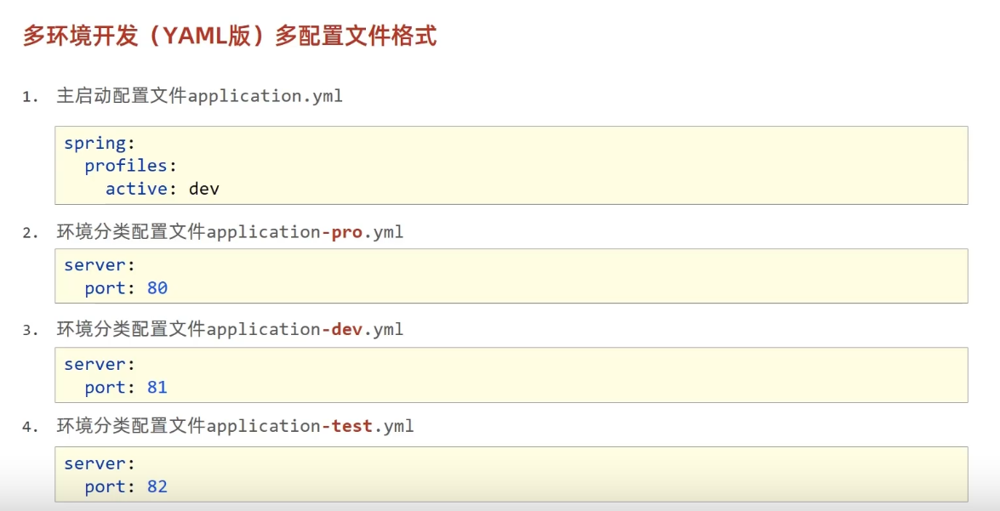

## 配置文件application.properties

## SpringBoot的多种属性配置格式

**加载优先级**

***properties>yml>yaml***

当多种配置文件共存时，前者没有的配置但后者有依然会生效，相同配置前者会覆盖后者。但一般不会有多个配置文件。

**yaml数据读取**

yaml自定义对象封装数据

SpringBoot配置文件等级分类

SpringBoot不同环境配置

