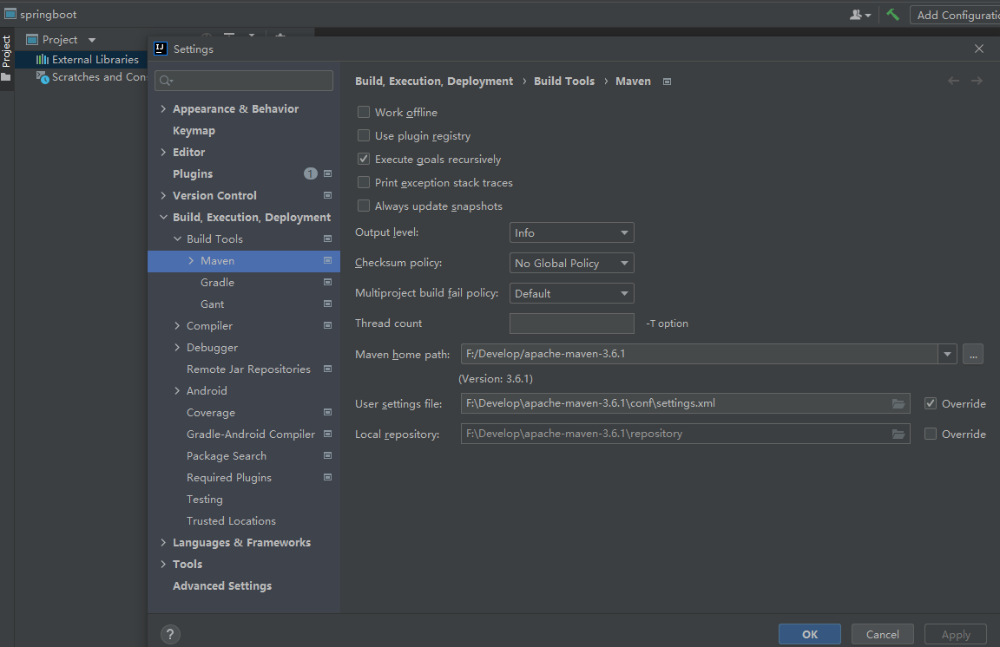

# 本地maven仓库配置

#### 一、apache-maven官网下载对应版本的maven压缩包

#### 二、下载解压缩到指定位置，打开conf目录下的settings.xml修改配置

- 配置本地仓库

```
<localRepository>F:/Develop/apache-maven-3.6.1/repository</localRepository>
```

- 配置远程仓库代理

  

```
<mirror>
      <id>alimaven</id>
      <mirrorOf>central</mirrorOf>
      <name>aliyun maven</name>
      <url>http://maven.aliyun.com/nexus/content/groups/public/</url>
    </mirror>
```

#### 三、将maven的bin文件夹所在目录添加到系统环境变量PATH中

#### 四、测试

在cmd中输入

```
 mvn -v
```

能查看maven版本则配置成功

五、在idea的settings中搜索maven配置，修改相关配置

